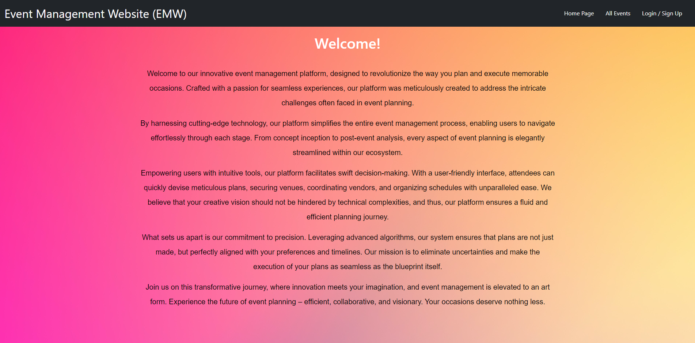
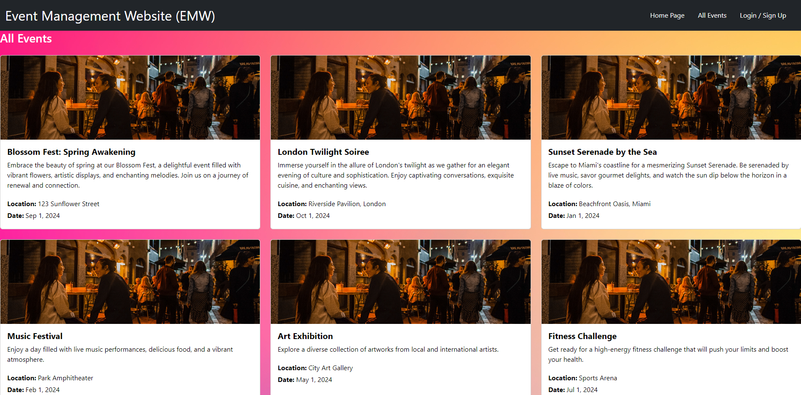
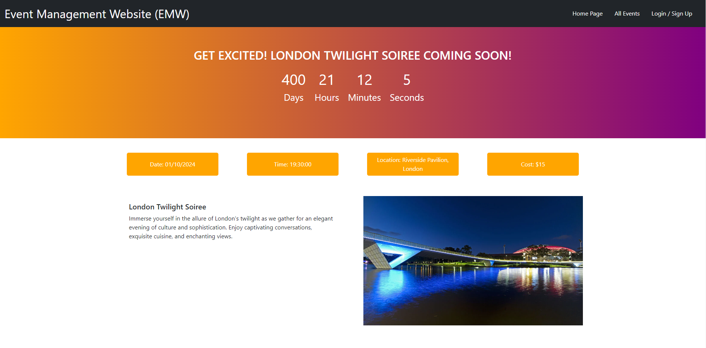

# 23 MERN Stack Application

Projects have played a key role in your journey to becoming a full-stack web developer. As you apply for development jobs, your portfolio is absolutely vital to opening doors to opportunities. Your portfolio showcases high-quality deployed examples of your work, and you can use your finished projects for that very purpose.

This project is a fantastic opportunity to show employers your collaborative skills and coding abilities, especially in the context of a scalable, user-focused MERN app. Remember that employers want to see what you can do, but they also want to see how you work with other developers. The more examples of deployed collaborative work you have in your portfolio, the more likely you are to get an interview and a job.


## Story: Event Registration

As a potential event attendee,

I want to easily register for an upcoming event,

So that I can secure my spot and receive event updates.


## Requirements

```
The homepage prominently displays the upcoming events.

Each event listing includes essential details like date, time, location, and a brief description.

Clicking on an event takes the user to a dedicated event page.

On the event page, there's a clear "Register" button.

Clicking the "Register" button opens a simple form asking for basic details (name, email, and contact number).

After filling in the details and submitting the form, the user receives a confirmation message.

The user's provided information is stored securely for event communication purposes.

An email is sent to the user confirming their registration and providing event-specific information.
```

## Generally the application should meet the following criteria:

```
-Application uses React for the front end.

-Application has a GraphQL API with a Node.js and Express.js server, and uses queries and mutations for retrieving, adding, updating, and deleting data.

-Application uses MongoDB and the Mongoose ODM for the database and protects sensitive API key information on the server.


-Application includes user authentication using JWT.
```
## What The Page Looks

This is the front page



This is the event page



This is the page that shows more information



## Deployed Link

This is the original link to the old repo
[Old link](https://github.com/DavidHCCNguyen/C-23-Event-Management-Platform)

This is the link to the new repo
[Current Link](https://github.com/DavidHCCNguyen/C-23.1-Event-Management-Platform)

This is the heroku deployment page
[Heroku](https://secret-harbor-55616-6d1ec3368d46.herokuapp.com/)